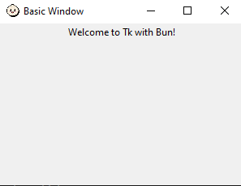

# Bun-Tkinter


**Bun-Tkinter** is a TypeScript wrapper for Tcl/Tk, offering a modern, object-oriented interface for developing GUI applications with Bun. Since this Library uses Bun:ffi, There's Zero external dependencies, except for Tcl itself.



## 🚀 Installation

To get started with Bun-Tkinter, clone the repository:

```bash
git clone https://github.com/bilal-08/Bun-Tkinter.git
cd Bun-Tkinter
```

## 📌 Note

Before running the examples, make sure to set the following environment variables to point to the necessary Tcl/Tk libraries:

(You can set these temporarily in PowerShell using the commands below.)

```powershell
$env:TCL_LIBRARY = "C:\\B\\bun-tkinter\\lib\\tcl86t.dll"
$env:TK_LIBRARY = "C:\\B\\bun-tkinter\\lib\\tk86t.dll"
```

## 🎉 Running Examples

To familiarize yourself with the library, you can run the provided examples:
> Note: uncomment more examples given the ./example.ts

```bash
bun run ./examples.ts
```

### 🛠 Example Code

Here’s a simple example demonstrating how to create a basic window using Bun-Tkinter:

```typescript
import { createTkApp, runTkApp, Tk } from ".";

// Basic window example
function basicWindowExample() {
    // Define the window name and dimensions.
    const root = createTkApp("Basic Window", "300x200");
    const label = root.Label("Welcome to Tk with Bun!");
    label.pack();
    runTkApp(root);
}
```

## 📝 TODO

- Add cross-platform executable files for **macOS** and **Linux** in the `./lib` folder.

---

This version includes emojis for a more visually engaging experience!